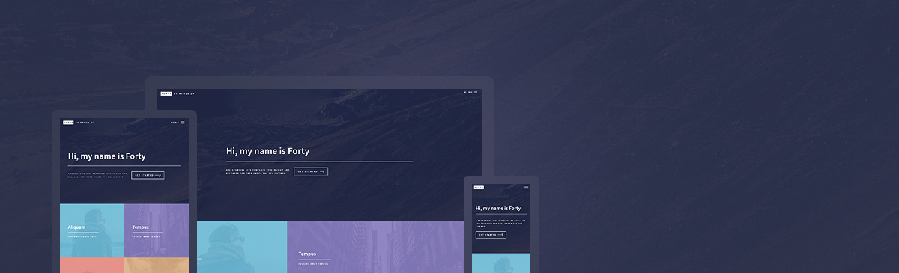

# FortyPlus - Jekyll Theme

A modified version of the Jekyll theme by [HTML5 UP](https://html5up.net/).  
This is my personal fork which adds many important features and makes the theme highly modular and user customizable.

<p align="center">

</p>

# Added Features

* very easy setup - fork the template and start posting
* beautiful [material ocean](https://github.com/material-ocean/Material-Ocean) color pallete 
* highly modularize the theme - most of the widgets and features are user togglable
* prope URl's for posts and projects
* remove the annoying date on post URL's
* better project structure - group all pages under the pages folder
* seperation between projects and posts 
* skills widget - add your skills under the skills key value pair in `config.yml`
* tiles for both posts and projects - you can toggle them in `_config.yml`
* go to top button
* separate page for each post and project 
* next and previous post navigation buttons 
* read time for posts and projects
* minimal syntax highlighting via [prism](https://prismjs.com/index.html)
* site wide search via [lunr](https://lunrjs.com)
* [disque](https://disqus.com/) comments integration for posts - add your disque forum name in `config.yml`
* fork repository button on projects
* better font awesome integration via fontawesome kit
* fix font awesome issues on mobile devices
* social media shareing icons for both projects and posts 
* RSS feed support
* separate contact page - add your details in `_config.yml`
* **[Formspree.io](https://formspree.io/) contact form integration** - just add your email to the `_config.yml` and it works!
* Add your **social profiles** easily in `_config.yml`. Only social profiles butons you enter in `config.yml` show up on the site footer, you can easily add your own social media's if they're not included by default

# Project Structure
```
.
 ├── assets
 │     ├── css
 │     ├── fonts
 │     ├── images
 │     └── js
 ├── _includes
 ├── _layouts
 ├── _pages
 ├── _posts
 └── _sass
        ├── base
        ├── components
        ├── layout
        └── libs
```
# How to Use

For those unfamiliar with how Jekyll works, check out [jekyllrb.com](https://jekyllrb.com/) for all the details, 
or read up on just the basics of [front matter](https://jekyllrb.com/docs/frontmatter/), [writing posts](https://jekyllrb.com/docs/posts/), 
and [creating pages](https://jekyllrb.com/docs/pages/).

- **GitLab**: Simply fork this repository and start editing the `_config.yml` file!  
- **GitHub**: Fork this reposity and create a branch named `gh-pages`, then start editing the `_config.yml` file.


# Credits

Original README from HTML5 UP:

```
Forty by HTML5 UP
html5up.net | @ajlkn
Free for personal and commercial use under the CCA 3.0 license (html5up.net/license)


This is Forty, my latest and greatest addition to HTML5 UP and, per its incredibly
creative name, my 40th (woohoo)! It's built around a grid of "image tiles" that are
set up to smoothly transition to secondary landing pages (for which a separate page
template is provided), and includes a number of neat effects (check out the menu!),
extra features, and all the usual stuff you'd expect. Hope you dig it!

Demo images* courtesy of Unsplash, a radtastic collection of CC0 (public domain) images
you can use for pretty much whatever.

(* = not included)

AJ
aj@lkn.io | @ajlkn


Credits:

	Demo Images:
		Unsplash (unsplash.com)

	Icons:
		Font Awesome (fortawesome.github.com/Font-Awesome)

	Other:
		jQuery (jquery.com)
		html5shiv.js (@afarkas @jdalton @jon_neal @rem)
		background-size polyfill (github.com/louisremi)
		Misc. Sass functions (@HugoGiraudel)
		Respond.js (j.mp/respondjs)
		Skel (skel.io)
```

Repository [Jekyll logo](https://github.com/jekyll/brand) icon licensed under a [Creative Commons Attribution 4.0 International License](http://choosealicense.com/licenses/cc-by-4.0/).
