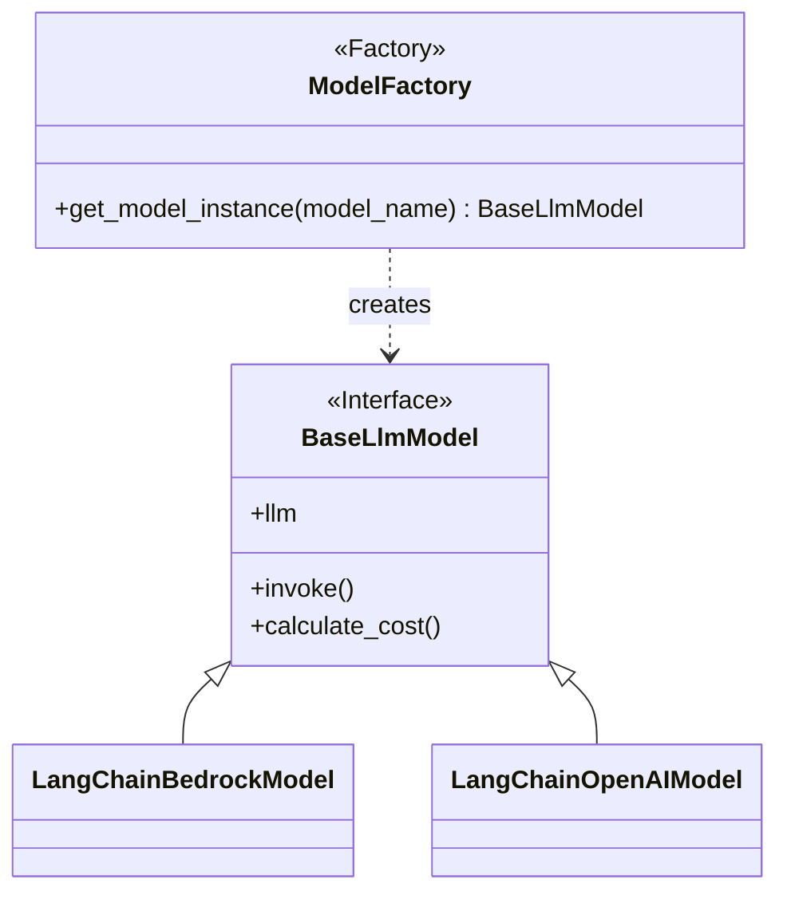
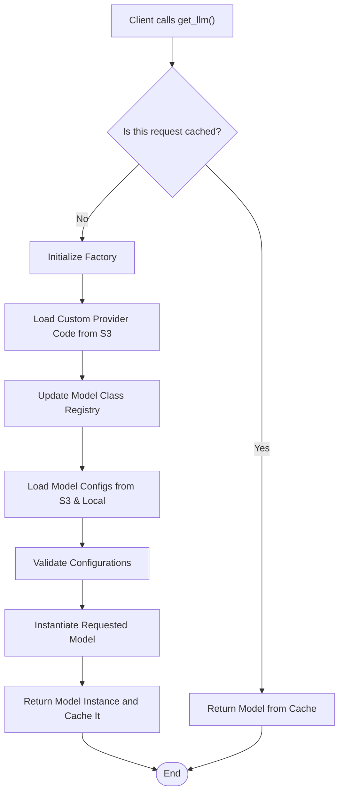

The world of AI and Machine Learning is a whirlwind of innovation. New models,
providers, and capabilities emerge constantly, making it both exciting and
challenging for developers. Integrating multiple Large Language Models (LLMs)
into an application—perhaps Claude from AWS Bedrock, GPT-4o from OpenAI, or a
local Llama variant—quickly reveals a common pain point: each model has its
unique API, configuration, and cost structure. Managing these integrations
efficiently and flexibly is paramount for any scalable AI application.

This post will guide you through building a robust, dynamic factory in Python.
We'll create a system that can load model configurations from external sources
(like YAML files on S3 or AWS Parameter Store) and then seamlessly instantiate
the correct model object at runtime. By leveraging modern best practices with
libraries like **LangChain**, **Pydantic**, **OmegaConf**, and **S3Path**, we'll
craft a single, elegant `get_llm` function that makes model access effortless
and your application future-proof.

## Understanding the Factory Pattern

Before diving into the "dynamic" aspects, let's briefly revisit the core Factory
Pattern. At its heart, the Factory Pattern provides an interface for creating
objects but lets the factory itself decide which specific class to instantiate.
It decouples the code that uses an object from the code that creates it. Instead
of your application code needing to know the specific details of how to build a
ClaudeModel versus a GPTModel, it simply asks a factory for what it needs:
get_llm("claude-v3-sonnet").

This relationship can be visualized with a class diagram. The client interacts
with a single ModelFactory. The factory, based on the input, produces a concrete
object (like LangChainBedrockModel or LangChainOpenAIModel) that conforms to a
common BaseLlmModel interface. The client receives this object, knowing it can
rely on the methods defined in BaseLlmModel without needing to know the specific
implementation details.



### Evolving to a Dynamic LLM Factory

Our goal is not just a static factory, but a dynamic one. This means the
factory's behavior—which concrete classes it can create and with what
parameters—is determined by external configuration, not hardcoded logic. This is
crucial for adapting to the fast-paced AI landscape.

The following flowchart illustrates this dynamic process. When a user calls our
get_llm function, it triggers a series of steps that read from an external
source to make a decision at runtime.



## Project Structure

Before we dive into the code, let's look at the project structure. This layout
separates concerns cleanly, making the system easy to understand and maintain.

the project is build as an installable Python package so you can simply pip
install it into your projects.

```bash
.
├── .env.example                 # Example environment variables
├── pyproject.toml               # Project metadata and dependencies
├── requirements.txt
├── src/
│   ├── __init__.py
│   ├── config_models.py         # Pydantic models for configuration
│   ├── exceptions.py            # Custom exception classes
│   ├── main.py                  # Demonstration script
│   ├── model_config/            # Directory for default model YAML files
│   │   ├── claude_sonnet_3_7.yaml
│   │   ├── gpt_4o.yaml
│   │   └── llama_3_8b_instruct.yaml
│   ├── model_factory.py         # The core factory logic and public API
│   └── models/                  # Model implementation modules
│       ├── __init__.py
│       ├── base_model.py        # Abstract base class for our model wrappers
│       ├── bedrock.py           # Concrete implementation for AWS Bedrock
│       └── openai.py            # Concrete implementation for OpenAI
└── ...
```

## Building Blocks for a Robust Dynamic Factory

To achieve this sophisticated dynamism and reliability, we'll leverage several
powerful Python libraries and design patterns.

### 1. Pydantic: For Bulletproof Configuration

Configuration is the backbone of our dynamic system. Instead of using plain
dictionaries, we'll use **Pydantic** models to define a strict schema. This
provides automatic validation, clear error messages, and type-safe access to
configuration data, catching errors before they become runtime problems.

```python
# src/config_models.py
from enum import Enum
from typing import Dict, Optional, Union
from pydantic import BaseModel, Field
from pydantic_settings import BaseSettings

class Provider(str, Enum):
    """Enumeration for supported LLM providers."""
    BEDROCK = "bedrock"
    OPENAI = "openai"

class ModelConfig(BaseModel):
    """Pydantic model for a single LLM configuration."""
    name: str
    provider: Union[Provider, str]
    model_id: str
    region_name: Optional[str] = None
    api_key_secret_name: Optional[str] = None
    api_key_env_var: Optional[str] = "OPENAI_API_KEY"
    input_token_cost: float = Field(0.0, ge=0.0, alias="input_token_cost_usd_per_million")
    output_token_cost: float = Field(0.0, ge=0.0, alias="output_token_cost_usd_per_million")
    max_tokens: int = Field(1024, ge=1)
    temperature: float = Field(0.7, ge=0.0, le=2.0)
    description: Optional[str] = None

class AllModelsConfig(BaseModel):
    """Pydantic model for the entire collection of LLM configurations."""
    models: Dict[str, ModelConfig] = Field(default_factory=dict)

class EnvSettings(BaseSettings):
    """Loads environment variables for configuration paths."""
    SSM_PROVIDER_PATH_PARAMETER: Optional[str] = "/LLM_CONFIG/PROVIDER_MODULES_S3_PATH"
    SSM_MODELS_PATH_PARAMETER: Optional[str] = "/LLM_CONFIG/MODELS_CONFIG_S3_PATH"
    OPENAI_API_KEY: Optional[str] = None

env = EnvSettings()
```

This schema ensures that any configuration we load will have the necessary
fields. Notice the use of `alias` to allow for more descriptive YAML keys
(`input_token_cost_usd_per_million`) while using shorter, more convenient
attribute names in our code (`input_token_cost`).

### 2. LangChain: A Common Ground for All Models

Modern AI applications rarely interact with LLM APIs directly. Libraries like
**LangChain** provide a powerful, unified abstraction layer. Our design
leverages this by defining our own `BaseLlmModel` that _wraps_ a LangChain
`BaseChatModel` instance.

This wrapper is a key design choice. It offers several advantages over returning
a raw LangChain object:

- **Application-Specific Functionality:** It allows us to add methods like
  `calculate_cost` that are relevant to our application's needs but not part of
  LangChain's core interface.
- **Future-Proofing:** It insulates our application from potential breaking
  changes in LangChain's API. If LangChain's `invoke` signature changes, we only
  update our wrapper, not every piece of client code.
- **Direct LangChain Access:** Crucially, it exposes the underlying LangChain
  `BaseChatModel` instance via an `.llm` property. This gives users the best of
  both worlds: our custom features and full access to LangChain's rich ecosystem
  (chains, agents, etc.).

```python
# src/models/base_model.py
from abc import ABC, abstractmethod
from langchain_core.language_models import BaseChatModel
from config_models import ModelConfig

class BaseLlmModel(ABC):
    """Abstract Base Class for all language models, wrapping LangChain's BaseChatModel."""

    def __init__(self, name: str, config: ModelConfig):
        self.name = name
        self.config = config
        self._llm: BaseChatModel = self._initialize_llm()

    @abstractmethod
    def _initialize_llm(self) -> BaseChatModel:
        """Initializes the underlying LangChain LLM based on the configuration."""
        pass

    @property
    def llm(self) -> BaseChatModel:
        """Provides direct access to the underlying LangChain BaseChatModel instance."""
        return self._llm

    def invoke(self, prompt: str, **kwargs) -> str:
        """Generates a response for a given prompt using the wrapped LangChain LLM."""
        print(f"[{self.name}] Invoking LangChain LLM...")
        try:
            return self._llm.invoke(prompt, **kwargs)
        except Exception as e:
            return f"Error calling {self.name} via LangChain: {e}"

    def calculate_cost(self, token_count: int, is_input: bool) -> float:
        """Calculates the cost for a given token count and direction (input/output)."""
        token_price = (
            self.config.input_token_cost if is_input else self.config.output_token_cost
        )
        return (token_count / 1_000_000) * token_price
```

The concrete implementations are now lean and focused. Their only job is to
translate our Pydantic `ModelConfig` into the arguments required by the
corresponding LangChain class.

```python
# src/models/bedrock.py
from langchain_aws import ChatBedrock
from langchain_core.language_models import BaseChatModel
from .base_model import BaseLlmModel
from config_models import ModelConfig

class LangChainBedrockModel(BaseLlmModel):
    """Concrete implementation for AWS Bedrock models using LangChain's ChatBedrock."""
    def _initialize_llm(self) -> BaseChatModel:
        return ChatBedrock(
            model_id=self.config.model_id,
            region_name=self.config.region_name,
            temperature=self.config.temperature,
            model_kwargs={"max_tokens": self.config.max_tokens},
        )
```

### 3. Externalizing Configuration: One File Per Model

Our model configurations live outside the application code, making them easy to
update without code changes. We've adopted a **one-file-per-model** strategy.
This is often simpler to manage than a single monolithic file, as adding or
updating a model is just a matter of adding or replacing a single file in a
directory, a process that's easy to automate.

Here's an example for `claude_sonnet_3_7.yaml`:

```yaml
name: "Claude Sonnet 3.7"
provider: "bedrock"
model_id: "anthropic.claude-3-sonnet-20240229-v1:0"
region_name: "us-east-1"
input_token_cost_usd_per_million: 3.0
output_token_cost_usd_per_million: 15.0
max_tokens: 4096
temperature: 0.7
description: "Anthropic's Claude Sonnet 3.7 model via AWS Bedrock."
```

To load these configurations, we'll use **OmegaConf** for its flexible parsing
capabilities and **S3Path** for simplified, Pythonic interaction with S3. S3Path
allows us to treat S3 objects and prefixes much like local file paths, making
operations like reading YAML files or globbing for multiple config files in a
directory straightforward.

### 4. The All-in-One Factory Function

The core of our dynamic factory is a single, elegant function that serves as the
public API for our entire system: `get_llm`. It encapsulates all the complexity,
providing a clean and efficient interface for developers.

Here's what `get_llm` does:

1. **Factory Instantiation:** It creates an instance of our internal
   `ModelFactory`.
2. **Configuration Loading & Validation:** It instructs the factory to load
   configurations from the specified `source_type` and `source_path`. The
   factory then uses OmegaConf to parse the raw data and Pydantic to strictly
   validate it.
3. **Model Instantiation:** Once configurations are loaded and validated, the
   factory looks up the requested `model_name_key` and instantiates the
   appropriate `BaseLlmModel` subclass.
4. **Caching:** The entire `get_llm` function is decorated with
   `functools.lru_cache`. This is a game-changer for performance. If you call
   `get_llm` with the exact same arguments (`model_name_key`, `local_path`,
   etc.) multiple times, the function will only execute once. Subsequent calls
   will instantly return the model from its cache.

```python
# src/model_factory.py (abbreviated for clarity)
from functools import lru_cache
from .base_model import BaseLlmModel

class ModelFactory:
    # ... (internal loading and instantiation logic as shown previously) ...
    # This class handles:
    # - Loading custom provider modules from S3 via SSM parameter.
    # - Loading model config YAMLs from a local path.
    # - Loading and merging model config YAMLs from an S3 path via SSM parameter.
    # - Validating the final merged config with Pydantic.
    # - Instantiating the correct model class based on the 'provider' key.

def _get_llm_cached(model_name_key: str, local_path: str) -> BaseLlmModel:
    """Internal helper to create and retrieve an instantiated LLM with caching."""
    factory = ModelFactory(local_path)
    return factory.get_model_instance(model_name_key)


@lru_cache(maxsize=128)
def _get_llm_lru(model_name_key: str, local_path: str) -> BaseLlmModel:
    """LRU-cached wrapper around the internal LLM retrieval function."""
    return _get_llm_cached(model_name_key, local_path)


def get_llm(
    model_name_key: str,
    local_path: str = get_default_config_dir(),
    force_reload: bool = False,
) -> BaseLlmModel:
    """
    Create and retrieve an instantiated LLM.

    Args:
        model_name_key (str): The key identifying the model.
        local_path (Path): The local path to a folder containing a yaml file for each model.
        force_reload (bool): Whether to force reload the the model factory content from S3.

    Returns:
        BaseLlmModel: The instantiated LLM model.
    """
    if force_reload:
        # Clear cached instances and reset the factory so providers/configs reload
        _get_llm_lru.cache_clear()
        ModelFactory.reset()
    return _get_llm_lru(model_name_key, str(local_path))
```

## Putting It All Together in Practice

With our architecture in place, using the factory is incredibly straightforward.
The library comes with built-in configurations, making it easy to get started.

```python
# main.py
from dotenv import load_dotenv
from langchain_core.prompts import ChatPromptTemplate
from src.model_config import get_default_config_dir
from src.model_factory import ModelNotFoundError, get_llm

# Load environment variables (e.g., OPENAI_API_KEY) from a .env file
load_dotenv()

claude_model = get_llm("claude_sonnet_3_7")
print(f"Retrieved model: {claude_model.name} ({claude_model.__class__.__name__})")
print(f"Claude sonnet Input Cost: ${claude_model.config.input_token_cost}/M tokens")

# Demonstrate direct LangChain usage via the .llm property
print("\n--- Demonstrating direct LangChain usage for Claude ---")
prompt_template = ChatPromptTemplate.from_messages(
    [("human", "Tell me a short, funny story about a programmer and a duck.")]
)
chain = prompt_template | claude_model.llm
# Uncomment the following lines to attempt actual API calls (requires valid AWS credentials)
# try:
#     response = chain.invoke({})
#     print(f"Claude (LangChain Chain) Response: {response.content[:100]}...")
# except Exception as e:
#     print(f"Error generating Claude response via chain: {e}")

# Requesting the same model again with the same source should return the cached instance
print("\n--- Requesting Claude again with same source to demonstrate caching ---")
claude_model_cached = get_llm("claude_sonnet_3_7")
print(
    f"Retrieved model (cached): {claude_model_cached.name} ({claude_model_cached.__class__.__name__})"
)
print(f"Is it the same instance? {claude_model is claude_model_cached}")

```

To confirm that loading providers and models from S3 works as expected, we
manually deleted the local `openai.py` and the `gpt_4o.yaml` files and placed
them in an S3 bucket. We then set the appropriate SSM parameters to point to the
S3 paths. Running the `main.py` script produced the following output,
demonstrating successful dynamic loading, instantiation, and caching:

```bash
llm-factory-pattern ❯ py src/main.py

--- Demonstrating from /home/blacksuan19/Random/git/llm-factory-pattern/src/model_config ---
Successfully registered custom provider: openai
Loading configurations from: /home/blacksuan19/Random/git/llm-factory-pattern/src/model_config
Successfully loaded 3 model configurations.
Retrieved model: Claude Sonnet 3.7 (LangChainBedrockModel)
Claude sonnet Input Cost: $3.0/M tokens

--- Demonstrating direct LangChain usage for Claude ---

--- Requesting Claude again with same source to demonstrate caching ---
Retrieved model (cached): Claude Sonnet 3.7 (LangChainBedrockModel)
Is it the same instance? True
Retrieved model: GPT-4o (LangChainOpenAIModel)
GPT-4o Output Cost: $15.0/M tokens

--- Demonstrating direct LangChain usage for GPT-4o ---
GPT-4o (LangChain Chain) Response: The capital of France is Paris.
Retrieved model: Llama 3 8B Instruct (LangChainBedrockModel)
Llama Input Cost: $0.25/M tokens
Caught expected error: Config for 'non_existent_model' not found.


```

## Final Thoughts for Production Environments

Building a robust system means thinking beyond the initial implementation. As
you move this pattern into production, keep these key principles in mind.

**Configuration Management is Key.** The choice of where to store your
configuration files is critical. For development, local files are fine. In
production, using a versioned S3 bucket or AWS Parameter Store provides better
security, access control, and auditability. This also allows you to have
different configuration files for different environments (development, staging,
production) simply by changing the `source_path` passed to `get_llm`.

**Understand Your Caching Strategy.** Our use of `lru_cache` is a powerful
performance booster, but it's important to understand its behavior. The cache is
keyed on the function's arguments. If you update the content of your
`models_config.yaml` on S3 without changing its path, subsequent calls to
`get_llm` with the same arguments will still return the old, cached model. To
pick up changes, you must either restart your application (which clears the
in-memory cache), manually call `get_llm.cache_clear()`, or adopt a strategy of
versioning your configuration file paths (e.g., `s3://.../config_v2.yaml`).

**Security First.** Never store sensitive information like API keys directly in
your configuration files, especially in a shared location like S3. The best
practice, as demonstrated in our design, is to store them in a secure vault like
AWS Secrets Manager and reference the secret's name in your configuration. The
factory can then fetch the secret at runtime, ensuring credentials are never
exposed in your code or configuration files.

By embracing the Dynamic Factory Pattern, you can build AI applications that are
not only powerful but also flexible, scalable, and easy to maintain. You
decouple your application logic from the ever-changing landscape of AI models,
empowering your team to adapt and innovate with speed and confidence.

## Conclusion

The dynamic factory pattern we've built provides an elegant and powerful
solution for managing a diverse and evolving set of AI models. By externalizing
model configurations and dynamically instantiating objects, you can build
systems that are flexible, scalable, and easy to maintain. This approach
empowers you to adapt to the fast-paced world of AI with minimal code changes
and maximum efficiency.

More broadly, this pattern addresses a common challenge in the data science and
AI fields: the transition from experimental code to production-ready software.
Often, projects that begin as innovative scripts or notebooks struggle to meet
the demands of a production environment, which requires robustness, scalability,
and maintainability. Code that was perfect for rapid prototyping may lack the
structure and error handling needed for the real world.

This is where software engineering principles become invaluable. The dynamic
factory pattern is a prime example of applying these principles to solve a
common AI development problem. This post is the first in a series dedicated to
bridging this gap. We aim to explore how established software engineering
practices can elevate AI projects from successful experiments to reliable,
enterprise-grade applications.
