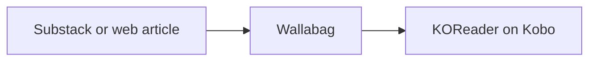
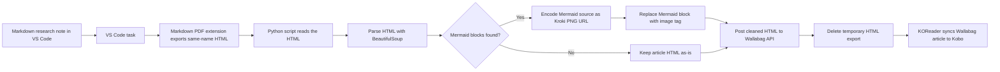

I like my Kobo because it gets out of the way. It has no notifications pulling
at me, no doom-scroll gravity, and no easy route from reading an article to
wondering why I am suddenly checking three unrelated things. The small
annoyance that started this side quest was simple. Long Substack-style articles
kept ending up in browser tabs and phone apps, while my Kobo sat unused.

[Wallabag](https://wallabag.org/) fit that problem neatly. It is a self-hostable
read-it-later app, similar in spirit to Pocket or Instapaper, but under my
control. It can fetch an article, extract the readable content, keep the
original URL and tags, and sync the result to clients. That made it a better
foundation than trying to manually send files to the Kobo or keep a pile of ad
hoc EPUB exports around.

The capture side also mattered. Wallabag has a browser extension, so saving
something from a desktop browser is one click away. It also has an Android app,
so the same flow works from a phone. In both places I can add tags while saving
the article, which keeps my reading inbox organized instead of turning into a
long undifferentiated queue.

[KOReader](https://koreader.rocks/) is the other half of the setup. It is an
open-source document reader for e-ink devices, and on the Kobo it can sync with
Wallabag directly. So I self-hosted Wallabag on my home server through CasaOS,
exposed it through my Cloudflare proxy, and configured KOReader on the Kobo to
sync against it. Once those pieces were connected, the whole thing settled into
a simple loop:

1. Save an article to Wallabag from the browser extension or Android app.
2. Tag it at capture time if it belongs to a topic.
3. Open KOReader on the Kobo.
4. Sync Wallabag.
5. Read.



That alone was already worth the setup. Wallabag became the capture and
organization layer, KOReader became the reading surface, and the Kobo finally
had a steady stream of the long-form web content I actually wanted to read
there.

## Research Notes Belong There Too

At some point I noticed that I was using Codex inside VS Code to generate and
refine research notes for interviews, products, companies, technical topics, and
project prep.

These notes were already useful as Markdown files. They had structure, links,
tables, and sometimes Mermaid diagrams. Inside VS Code, though, they still felt
like working material.

VS Code is where I work. The Kobo is where I settle into reading.

That distinction matters more than it sounds. A document can contain the same
words in both places, but the device changes the mode my brain enters. If I am
in VS Code, I want to edit, search, jump, compare, rewrite, and run things. If I
am on the Kobo, I want to sit with the material.

So the new question became:

> Can I push local Markdown research notes from VS Code into Wallabag?

At first I assumed this would be a manual export-and-upload situation. Then I
remembered that VS Code has tasks.

I had used tasks before for ordinary command-line automation, but I had not
really internalized how much glue they can provide inside the editor. A task can
call a script, pass the current file path, read environment variables, run as a
keyboard shortcut, and even trigger VS Code command inputs.

That was enough to turn the idea into a small tool.

## Pushing an Exported HTML File

The first working version was deliberately simple.

I would export the Markdown file to HTML, then run a Python script from a VS
Code task. The task passed the active Markdown file path to the script:

```json
{
  "label": "Sync Exported HTML to Wallabag",
  "type": "shell",
  "command": "python",
  "args": ["${workspaceFolder}/.vscode/wallabag_sender.py", "${file}"]
}
```

The script looked for a sibling `.html` file with the same base name:

```python
md_path = Path(md_file_path).expanduser().resolve()
html_file_path = md_path.with_suffix(".html")
```

Then it read that HTML and pushed it to Wallabag through the API:

```python
payload = {
    "url": f"https://vscode.internal{_safe_slug(title)}",
    "title": title,
    "content": html_content,
    "tags": config.tags,
}
```

This was already useful. I could write or generate a research note, export it,
run the task, sync KOReader, and read the note on the Kobo.

But the first nice version of a tool is rarely the final version. The first
problem showed up as soon as a note contained a Mermaid diagram.

## The Mermaid Problem

The generated notes often include Mermaid diagrams for flows and systems. In VS
Code, the preview looked fine. In Wallabag, the diagram disappeared.

At first I thought the issue was the HTML export. Maybe the preview extension
was rendering Mermaid as SVG, and Wallabag was stripping the SVG. So the first
attempt was:

1. Find the Mermaid SVG in the exported HTML.
2. Convert the SVG to PNG.
3. Replace the Mermaid block with an ``.
4. Push the resulting HTML to Wallabag.

That partially worked. The script could find Mermaid blocks and create an image.
But then Wallabag changed the image source to something like:

```html
src="denied:data:image/png;base64,..."
```

That led to the next discovery. Wallabag was intentionally blocking `data:`
image URLs. The image bytes were in the HTML, but Wallabag sanitized them.

Even after manually removing the `denied:` prefix in the browser inspector, the
image had another problem. The diagram shapes were visible, but the text was
missing. Mermaid's SVG output can use browser-rendered labels, and the simple
SVG-to-PNG conversion path did not preserve those labels correctly.

So the naive flatten-SVG-to-PNG solution failed in two different ways:

- Wallabag did not like inline `data:` image URLs.
- The conversion path did not preserve Mermaid text reliably.

That is when Kroki entered the picture.

## The Kroki Fix

[Kroki](https://kroki.io/) is a diagram rendering service. You give it a diagram
definition, and it returns an image. It supports Mermaid, which made it a good
fit here.

The key move was to stop trying to embed image bytes inside the Wallabag entry.
Instead, the script turns a Mermaid block into a normal HTTPS PNG URL:

```python
def _mermaid_source_to_kroki_png_url(source: str, config: AppConfig) -> str:
    compressed = zlib.compress(source.encode("utf-8"), 9)
    encoded = base64.urlsafe_b64encode(compressed).decode("ascii")
    return f"{config.kroki_url.rstrip('/')}/mermaid/png/{encoded}"
```

Then the script replaces the Mermaid block with a regular image tag:

```python
image_url = _mermaid_source_to_kroki_png_url(source, config)
new_img_tag = soup.new_tag(
    "img", src=image_url, alt=f"Mermaid diagram {index}"
)
new_img_tag["style"] = "max-width:100%;height:auto;"
mermaid_div.replace_with(new_img_tag)
```

That solved both problems:

- Wallabag accepts the image because it is an ordinary `https://` URL.
- Kroki renders the diagram with the labels intact.

There are tradeoffs. The diagram source is encoded in the URL, not encrypted, so
this is not something I would use for secrets or private architecture. But for
local interview prep and product research notes, where I still have the Markdown
source and a Wallabag copy is just for comfortable reading, it is a very
practical tradeoff.

Local Markdown remains the source of truth. Wallabag is the reading mirror.

## Cleaning Up the Script

Once the core behavior worked, I did the usual cleanup pass.

The original version had credentials directly in the script. That was fine for a
five-minute local experiment, but not for something that might live in a repo.
So I moved configuration into a local env file:

```text
.vscode/wallabag.env
```

and added it to `.gitignore`.

The script now loads keys like:

```text
WALLABAG_URL=
WALLABAG_CLIENT_ID=
WALLABAG_CLIENT_SECRET=
WALLABAG_USERNAME=
WALLABAG_PASSWORD=
KROKI_URL=
WALLABAG_TAGS=
WALLABAG_TIMEOUT_SECONDS=
```

I also added `argparse`, `pathlib`, dataclasses, and type hints. None of that is
fancy, but it changes the script from a pile of working code to a small tool I
will not hate opening in a month.

The shape is now:

```python
@dataclass(frozen=True)
class AppConfig:
    wallabag_url: str
    client_id: str
    client_secret: str
    username: str
    password: str
    kroki_url: str
    tags: str
    timeout_seconds: int
```

The actual CLI is simple:

```bash
python .vscode/wallabag_sender.py \
  --env-file .vscode/wallabag.env \
  path/to/note.md
```

The script resolves `path/to/note.html`, processes diagrams, uploads to
Wallabag, and deletes the generated HTML after a successful upload so the repo
does not collect disposable export files.

## Letting VS Code Export the HTML

There was still one manual step left: exporting the Markdown file to HTML before
running the task.

At first I was using Markdown Preview Enhanced exports. That worked, but once I
realized Wallabag was not preserving the exported CSS anyway, the styling of the
intermediate HTML stopped mattering. I only needed structurally valid HTML with
the content in it.

That opened the door to using the `Markdown PDF` VS Code extension, which
exposes a command:

```text
extension.markdown-pdf.html
```

The neat VS Code trick is that task inputs can call extension commands. So the
single task now triggers the HTML export as an input side effect, then runs the
Python script:

```json
{
  "label": "Export HTML and Sync to Wallabag",
  "type": "shell",
  "command": "python",
  "args": [
    "${workspaceFolder}/.vscode/wallabag_sender.py",
    "--env-file",
    "${workspaceFolder}/.vscode/wallabag.env",
    "${file}"
  ],
  "options": {
    "env": {
      "MARKDOWN_PDF_HTML_EXPORT_TRIGGER": "${input:exportMarkdownToHtml}"
    }
  }
}
```

and the input is:

```json
{
  "id": "exportMarkdownToHtml",
  "type": "command",
  "command": "extension.markdown-pdf.html",
  "args": {}
}
```

That environment variable is not important to the Python script. It is just a
clean place to make VS Code evaluate the input command before the task runs.
That command exports the active Markdown file to HTML, and then the script picks
up the generated sibling `.html` file.

The result is exactly what I wanted:

1. Open a Markdown research note in VS Code.
2. Press one keyboard shortcut.
3. VS Code exports HTML.
4. Python rewrites Mermaid diagrams to Kroki images.
5. Python pushes the article to Wallabag.
6. Python deletes the temporary HTML file.
7. KOReader syncs it to the Kobo.

By this point, the full path looked like this:



That is a lot of machinery hiding behind one shortcut, but it feels light
because every piece is doing a small job.

## Why This Feels Better Than a Bigger System

I could imagine turning this into a larger knowledge pipeline with queues,
storage, object uploads, background workers, a custom browser extension, and
more durable image hosting.

But that would be solving a different problem.

The goal here is not archival infrastructure. The source documents already live
locally. The goal is to move a document from a working context into a reading
context with as little ceremony as possible.

That is why the setup feels right:

- Wallabag is good at being a reading inbox.
- KOReader is good at turning the Kobo into a calm reader.
- VS Code is good at editing and automation.
- Tasks are good glue.
- Python is enough for the API and HTML manipulation.
- Kroki is enough for Mermaid diagrams.

The result is not perfect. It is better than that. It is boring and useful.

## A Small Note on Device Context

The surprising lesson here was not about Wallabag or VS Code tasks. It was about
respecting device context. I already had research notes, the Kobo, and a
self-hosted service that could bridge them. The missing piece was not a new app.
It was a small amount of glue that changed the notes from files I can open into
things I can sit down and read.

That is a subtle but meaningful difference. Some personal tooling is useful
because it removes exactly one piece of friction from a loop you actually care
about. This pipeline does that for me, and yes, it is deeply satisfying that the
whole thing now runs from a single keyboard shortcut.
